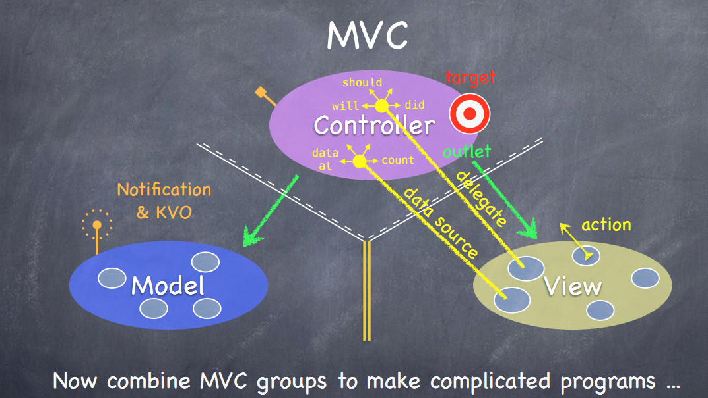
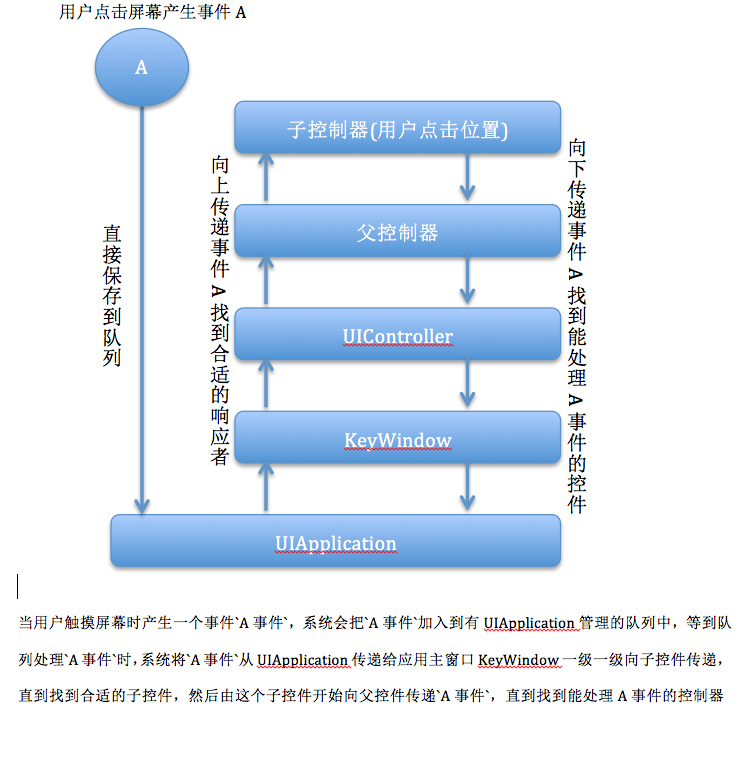

##2017-02-21

**1.写出中序遍历二叉树的算法(不限编程语言，已知 TreeRoot 为二叉树的根)。**  

    最近在学 Python 所以整理了一个 Python 版的

```python
# -- coding: UTF-8 --
# @Date    : 2017-02-21
# @Author  : CepheusSun
# @Version : python 2.7

class Tree(object):
    def __init__(self, data, left, right):
        self.data = data
        self.left = left
        self.right = right


def in_visit(tree):
    """递归中序遍历"""
    if tree:
        in_visit(tree.left)
        print (tree.data)
        in_visit(tree.right)
        

def in_stack(tree):
    """堆栈中序遍历"""
    if tree:
        my_stack = []
        node = tree
        while node or my_stack:
            while node:
                my_stack.append(node)
                node = node.left
            node = my_stack.pop()
            print(node.data)
            node = node.right

            print my_stack2.pop().data


def main():
    node1 = Tree(1, 0, 0)
    node2 = Tree(2, 0, 0)
    node3 = Tree(3, node1, node2)
    node4 = Tree(4, 0, 0)
    node5 = Tree(5, node4, node3)
    print("the post_visit is ...")
    post_visit(node5)
    post_stack(node5)
    print("the pre_visit is ...")
    pre_visit(node5)
    pre_stack(node5)
    print("the in_visit is ...")
    in_visit(node5)
    in_stack(node5)


if __name__ == '__main__':
    main()

```

**2.快速排序，归并排序的时间复杂度分别是什么？**  

* 归并排序：稳定，时间复杂度 O(nlog n)
* 快速排序：不稳定，时间复杂度 最理想 O(nlogn) 最差时间O(n^2)

```python
# -- coding: UTF-8 --
# @Date    : 2017-02-21
# @Author  : CepheusSun
# @Version : python 2.7


def quick_sort(array, first_index, last_index):
    """快速排序"""
    if first_index < last_index:
        div_index = partition(array, first_index, last_index)
        quick_sort(array, first_index, div_index)
        quick_sort(array, div_index + 1, last_index)
    else:
        return


def partition(array, first_index, last_index):
    i = first_index - 1
    for j in range(first_index, last_index):
        if array[j] <= array[last_index]:
            i += 1
            array[i], array[j] = array[j], array[i]
    array[i + 1], array[last_index] = array[last_index], array[i + 1]
    return i


def merge(left, right):
    i, j = 0, 0
    res = []
    while i < len(left) and j < len(right):
        if left[i] <= right[j]:
            res.append(left[i])
            i += 1
        else:
            res.append(right[j])
            j += 1
    res += left[i:]
    res += right[j:]
    return res


def merge_sort(array):
    """并归排序"""
    if len(array) <= 1:
        return array
    num = len(array) / 2
    left = merge_sort(array[:num])
    right = merge_sort(array[num:])
    return merge(left, right)


def main():
    array = [1, 4, 7, 5, 4, 9, 5, 8, 76, 5, 567, 54, 6, 54, 5, 5, 4, 0]
    print("initial array : \n", array)
    print("merge sort result: \n", merge_sort(array))
    quick_sort(array, 0, len(array) - 1)
    print("result array :\n", array)


if __name__ == '__main__':
    main()

``` 
    
**3.UITableViewCell 可重用机制是什么?有什么要注意的地方?**

UITableView 通过重用单元格来达到节省内存的目的：通过为每个单元格指定一个重用标识符，即指定来单元格的种类，以及当单元格滚出屏幕时，允许恢复单元格以便重用。对于不同种类的单元格使用不同的ID，对于简单的表格，一个标识符就够了。

需要注意的地方：
    取出来的cell是有可能已经捆绑过数据或者加过子视图的，如果有必要，要清除需要用与显示的数据和remove掉add过的子视图。不然会造成错乱的情况


**4.OC 中的 @property 和 @synthesize 有什么用？**

答：
iOS2.0 Apple引入 `@property` `@synthesize` 概念，两者组合使用可以自动生成 `seter` `geter`方法，iOS4.0以后只需要 `@property` 即可实现 自动生成 `seter` `geter`方法。

```obj-c
//setter
- (void)setObjStr:(NSString *)objStr {  
     if (_ objStr != objStr) {
        [_objStr release];
         _objStr = [objStr copy];
     }
  }
//getter
- (NSString *)objStr {
     return _objStr;
  }
```
以上代码等价于
 
```obj-c
//iOS2.0-iOS4.0
@interface Obj : NSObject
@property (nonatomic, copy) NSString *objStr;
@end

@implementation Object
@synthesize objStr = _ objStr;
@end
```
iOS4.0及以后

```obj-c
@interface Obj : NSObject
@property (nonatomic, copy) NSString *objStr;
@end
```
**5.OC有没有重载(overload)和重写(overwrite)？有的话请举个例子。**

答：
OC 语言不支持重载

```obj-c
-(void)doSth:(NSInteger)integer;
-(void)doSth:(NSString *)str; 
//对Objective-C而言是一样的，都叫方法doSth: 同时定义实现这两个方法是无法编译通过的。 若要达到类似重载的效果，可以这样跟不同参数：
-(void)doSthWithInt:(NSInteger)integer;
-(void)doSthWithStr:(NSString *)str
```
OC 支持重写

    子类重写父类方法

**6.列举出 iOS 开发中三种最常出现的循环引用的场景。**

答：

* delegate 被强引用了，代理应该使用 weak (拓展 weak 干了啥使自己可以防止循环的出现)  
* 使用 block 的时候，注意是否出现互相持有。  
* 使用 NSTimer 的时候，我们可能会使`+scheduledTimerWithTimeInterval:target:selector:userInfo:repeats:` 这个方法在建立的时候需要指定 target ，会被 timer retain 一份。因为 timer 还在一直执行，就会导致无法运行 dealloc的方法。

**7.MVC 模式具体指什么？iOS现在流行的 MVVM 是什么？**

MVC：


~~MVC模式考虑三种对象：模型对象、视图对象和控制器对象。 模型对象负责应用程序的数据和定义操作数据的逻辑； 视图对象知道如何显示应用程序的模型数据； 控制器对象是M与V之间的协调者。~~

* MVC模式(Model-View-Controller)是软件工程中的一种软件架构模式，把软件系统分成三个基本部分：模型(Model)/视图(View)/控制器(Controller)。 

* 数据Model： 负责封装数据、存储和处理数据运算等工作  
  视图View ： 负责数据展示、监听用户触摸等工作  
  控制器Controller： 负责业务逻辑、事件响应、数据加工等工作  
  
* 在传统的MVC结构中，数据层在发生改变之后会通知视图层进行对应的处理，视图层能直接访问数据层。但在iOS中，M和V之间禁止通信，必须由C控制器层来协调M和V之间的变化。如下图所示，C对M和V的访问是不受限的，但M和V不允许直接接触控制器层，而是由多种Callbacks方式来通知控制器 
    
MVVM： [MVVM 介绍](https://objccn.io/issue-13-1/)    
MVVM 把 View Controller 作为 View
View 和 Model 之间没有紧耦合
MVVM 是在 View 和 ViewModel 之间进行绑定。
什么是 ViewModel 呢？基本上来说，它是 View 和 View 状态的独立于 UIKit 外的一个呈现，ViewModel 调用 Model 中的的变化，根据 Model 的变化进行调整，并且通过 View 和 ViewModel 的绑定，同步调整 View。

**8.iOS 中设计金钱计算和比较时，用数值应该用哪个类型来处理？**  

使用 NSDecimalNumber  

* `NSDecimalNumber` 继承于 `NSNumber`   
* `NSDecimalNumber` 包含  加减乘除，幂运算，指数运算，四舍五入，比较运算。  

	```obj-c
	/** 示例 比较运算
	NSOrderedAscending 升序
	NSOrderedSame 相等
	NSOrderedDescending 降序
	- (NSComparisonResult)compare:(NSNumber *)decimalNumber;
	*/
	NSDecimalNumber *discount1 = [NSDecimalNumber decimalNumberWithString:@"1.2"];
	NSDecimalNumber *discount2 = [NSDecimalNumber decimalNumberWithString:@"1.3"];
	NSComparisonResult result = [discount1 compare:discount2];
	if (result == NSOrderedAscending) {
	    NSLog(@"1.2 < 1.3");
	} else if (result == NSOrderedSame) {
	    NSLog(@"1.2 == 1.3");
	} else if (result == NSOrderedDescending) {
	    NSLog(@"1.2 > 1.3");
	}
	
	输出结果 1.2 < 1.3
	``` 

**9.iOS 上触摸事件的视图检测和事件传递过程是怎样的？**  

事件的产生： 
 
* 发生触摸事件后，系统会将该事件加入到一个由UIApplication管理的事件队列中。(为什么是队列而不是栈？因为队列的特定是先进先出，先产生的事件先处理才符合常理，所以把事件添加到队列。)

* UIApplication会从事件队列中取出最前面的事件，并将事件分发下去以便处理，通常，先发送事件给应用程序的主窗口（keyWindow）。

* 主窗口会在视图层次结构中找到一个最合适的视图来处理触摸事件，这也是整个事件处理过程的第一步。找到合适的视图控件后，就会调用视图控件的touches方法来作具体的事件处理。

事件的传递：  

* 触摸事件的传递是从父控件传递到子控件，也就是UIApplication->window->寻找处理事件最合适的view  

引申：响应者链

* 当事件的传递从父控件遍历找到最适合响应的子控件后，由子控件调用`- (void)touchBegan:withEvent`此方法默认是把事件传递给父控件
* 所以响应者链是从子控件开始向父控件传递，一直传到UIApplication，如果都不能响应则丢弃




**10.写一个折半查找或者快速排序**

    用 Python写了一个二分查找
    
```python
# -- coding: UTF-8 --
# @Date    : 2017-02-21
# @Author  : CepheusSun
# @Version : python 2.7


def in_bisect(word_list, word):
    """check weather a word is in a list using bisection search.
    Precondition: the words in the list are sorted

    :param word_list: list of strings
    :param word: string
    """
    if len(word_list) == 0:
        return False

    # 结果四舍五入
    i = len(word_list) // 2
    if word_list[i] == word:
        return True

    if word_list[i] > word:
        # search the first half
        return in_bisect(word_list[:i], word)
    else:
        # search the second half
        return in_bisect(word_list[i + 1:], word)


def main():
    array = ['1', 'asf', 'sf2', 'df1', '2das', '5asdfd', '0sadf',
            '2ge', 'efc2', '1eds', '2ef', '2apple', 'apple', 'orange']
    print(in_bisect(array, '1'))
    print(in_bisect(array, '111'))


if __name__ == '__main__':
    main()

```


**参考资料**  
[资料1](http://blog.sina.com.cn/s/blog_771849d301010ta0.html)

[Objective-C 之 @property和@synthesize](https://my.oschina.net/iamzkt/blog/126503)  

[回炉篇之（一）-- @property和@synthesize](https://www.pupboss.com/property-and-synthesize/)  

[iOS开发：Objective-C精确的货币计算](http://arthurchen.blog.51cto.com/2483760/761426) 
  
['NSDecimalNumber--十进制数'使用方法(带例子)](http://www.jianshu.com/p/4703d704c953)

[objective c-OC中有方法重载吗？具体是怎么样？](https://yq.aliyun.com/wenzhang/show_41715)

think python

