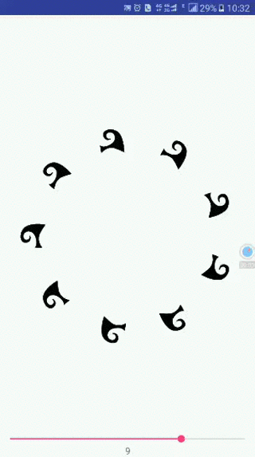
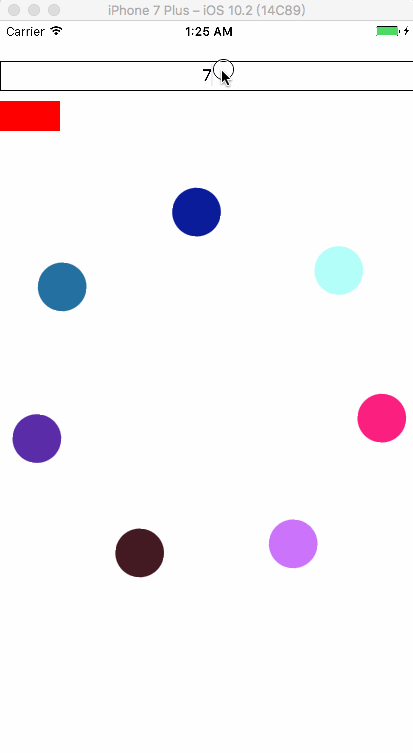

##大体思路就是这样了（这个Demo凑数用的😂）
用collectionView + CABasicAnimation 做的(秉承能复制尽量不敲代码的原则，厚脸皮的复制了[iOS流布局UICollectionView系列五——圆环布局的实现](https://my.oschina.net/u/2340880/blog/523064)实现圆形布局的代码)  
大晚上的只想试试思路能不能行得通，没注意什么代码规范。方法还有很多种。~~别喷，会生气。~~ 

小图的旋转可以用同一个方法实现，没什么难的洗洗睡吧。(刚开始没想明白还想用函数什么的布局一个圆出来也是对自己智商抓急)

**效果**

|原动画 | 简单实现思路|
|------|-----------|
|   | |

**ps.**  
原动画可能是通过双指滑动实现的圈子放大缩小，这也不难，不写了。
第一次拿Sketch做简历，今天又没做。😭